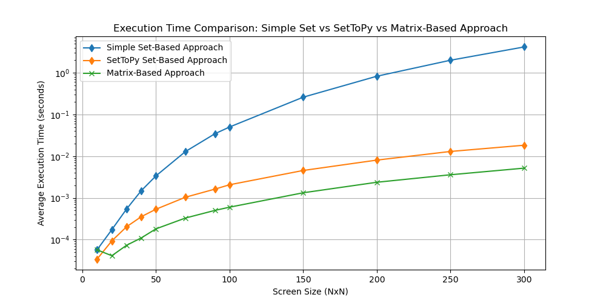

# SetToPy

<p align="center">
<a href="https://github.com/psf/black"></a>
</p>

**SetToPy** is a Python library designed to showcase the interconnectedness and transposability of set theory, matrices, algebra, and Cartesian grids. This library aims to provide a robust framework for performing operations on sets and demonstrating the transformations between different mathematical abstractions.

## Organization Coding Guideline: Embracing Hybrid Paradigms for Scalable and Performant Code

This document presents a comprehensive coding guideline that embraces a hybrid approach, combining Object-Oriented Programming (OOP) and Functional Programming (FP) principles to achieve scalable, performant, and maintainable code. We explore the foundational theories of set theory, matrices, and algebra, highlighting their interchangeability and relevance to modern programming paradigms. The guideline underscores the practical benefits of integrating OOP with set theory and leveraging FP techniques grounded in lambda calculus and type theory.

Key concepts such as immutability, higher-order functions, and pure functions are emphasized to create modular and expressive code. The document also introduces a hybrid coding style that balances the structural advantages of OOP with the functional ethos of FP, showcasing a flexible function registry for modular and extensible function management.

Furthermore, we discuss the potential of constraint programming paradigms in enhancing Natural Language Processing (NLP) systems, combining rule-based reasoning with statistical learning for improved grammatical correctness and contextual appropriateness. This guideline aims to provide a robust framework for developing software that meets the highest standards of efficiency and reliability, preparing for the evolving challenges in the AI and computational landscapes.

## Interconnectedness and Transposability of Set Theory, Matrices, Algebra, and Cartesian Grids

Understanding the interconnectedness and transposability of set theory, matrices, algebra, and Cartesian grids provides valuable insights for coding and problem-solving. However, transforming these concepts back and forth incurs some "information" expense. For instance, a set can be ordered and converted into a matrix, such as:

\[ S = {(1,2), (3,4), (5,6)} \]

becoming a 3x2 matrix:

S = 

<div style="display: inline-block;">
  &#91; 1 &nbsp; 2 &#93;<br>
  &#124; 3 &nbsp; 4 &#124;<br>
  &#91; 5 &nbsp; 6 &#93;
</div>


Conversely, matrices can be viewed as sets of rows or elements, but the inherent order in matrices may be lost when converting back to sets. Sets can form algebraic structures by defining operations, like the set {0, 1, 2} with addition modulo 3 forming a group, but the specific operations may not always translate back neatly to pure sets. Algebraic structures described as sets with operations may lose some operational context when viewed only as sets. Similarly, sets can represent points in a Cartesian grid, where elements act as coordinates, such as:

\[ {(x₁, y₁, z₁), (x₂, y₂, z₂)} \]

but spatial relationships may be lost when converting these points back into sets. This interconnectedness can be summarized as:

\[ {Set} ⇔ {Algebra} ⇔ {Matrix} ⇔ {Cartesian Grid (3D)} \]

Or we can represent these transformations in lambda calculus as functions mapping from one set to another. Each transformation can be seen as a function f that takes an input from one set and produces an output in another set. Here's how we can represent this in lambda calculus:

### Transformations

1. **Set to Algebra:**
   \[ λ S. Algebra(S) \]
   Here, Algebra(S) represents the transformation from a set S to its corresponding algebraic structure.

2. **Algebra to Matrix:**
   \[ λ A. Matrix(A) \]
   Here, Matrix(A) represents the transformation from an algebraic structure A to its corresponding matrix representation.

3. **Matrix to Cartesian Grid (3D):**
   \[ λ M. CartesianGrid(M) \]
   Here, CartesianGrid(M) represents the transformation from a matrix M to its corresponding Cartesian grid representation in 3D space.

### Combined Transformation

Combining these, we can represent the overall transformation as a composition of these functions:

\[ λ S. CartesianGrid(Matrix(Algebra(S))) \]

In a more general form, for any transformation f from set A to set B, we can write:

\[ y = f(x) \quad \text{where} \quad x ∈ {A} \quad \text{and} \quad y ∈ {B} \]

For the specific chain of transformations:

\[ λ S. CartesianGrid(Matrix(Algebra(S))) \]

In lambda calculus notation, the transformation chain is expressed as:

\[ {Set} → {λ S. Algebra(S)} → {Algebra} → {λ A. Matrix(A)} → {Matrix} → {λ M. CartesianGrid(M)} → {Cartesian Grid (3D)} \]

## Set Theory-Based Paradigm

We demonstrate that our library "SetToPy" allows for building a foundational paradigm based on set theory, bypassing the traditional matrix-based approach. By employing advanced data structures and optimizing performance through lower-level languages like C++, we achieve efficiency nearly on par with the NumPy matrix framework.



While set theory-based coding standards show significant potential for future developments, our current focus does not include further exploration in this area. Instead, we will adhere to this new standard with these considerations in mind.

Note: We also explore the historical alignment of mathematics and coding in capturing reality, tracing back to Kant and particularly emphasizing Frege's logic, which underpins modern computational languages.


## Installation

# Building and Setting Up the Project

## Prerequisites

1. **Install Miniforge**:
   - Download the Miniforge installer for Apple Silicon (arm64):
     ```sh
     wget https://github.com/conda-forge/miniforge/releases/latest/download/Miniforge3-MacOSX-arm64.sh
     ```
   - Run the installer:
     ```sh
     bash Miniforge3-MacOSX-arm64.sh
     ```

2. **Create and Activate Conda Environment**:
   - Create a new Conda environment with Python 3.9:
     ```sh
     conda create -n myenv python=3.9
     ```
   - Activate the environment:
     ```sh
     conda activate myenv
     ```

3. **Verify the Python Architecture**:
   - Ensure the environment is set to use arm64 architecture:
     ```sh
     python -c "import platform; print(platform.machine())"
     ```
   - It should return `arm64`.

## Installing Dependencies

1. **Install `pybind11`**:
   - Install `pybind11` within the Conda environment:
     ```sh
     conda install pybind11
     ```

## Building the Extension

1. **Clean Previous Builds**:
   - Remove any previous build artifacts:
     ```sh
     python setup.py clean --all
     ```

2. **Build the Extension**:
   - Build the C++ extension using `setup.py`:
     ```sh
     python setup.py build
     ```

3. **Install the Extension**:
   - Install the built extension into the Conda environment:
     ```sh
     python setup.py install
     ```

## Testing the Extension

1. **Run the Performance Test**:
   - Ensure the environment is activated:
     ```sh
     conda activate myenv
     ```
   - Run the performance test script:
     ```sh
     python test_performance.py
     ```

## Usage

Here’s a simple example to get you started:

```python
from settopy import SetToPy

# Initialize set
s = SetToPy()

# Add elements
s.add(1.0, 2.0, 3.0)
s.add(4.0, 5.0, 6.0)

# Check membership
print(s.contains(1.0, 2.0, 3.0))  # Output: True
print(s.contains(7.0, 8.0, 9.0))  # Output: False

# Remove element
s.remove(1.0, 2.0, 3.0)

# Get size
print(s.size())  # Output: 1

# Convert to list
print(s.get_elements())  # Output: [(4.0, 5.0, 6.0)]
```

## Contributing

Contributions are welcome! Please read the [contributing guidelines](CONTRIBUTING.md) first.

## License

This project is licensed under the Apache 2.0 License - see the [LICENSE](LICENSE) file for details.

## Acknowledgments

- [NumPy](https://numpy.org/)
- [pybind11](https://github.com/pybind/pybind11)
- [CMake](https://cmake.org/)
